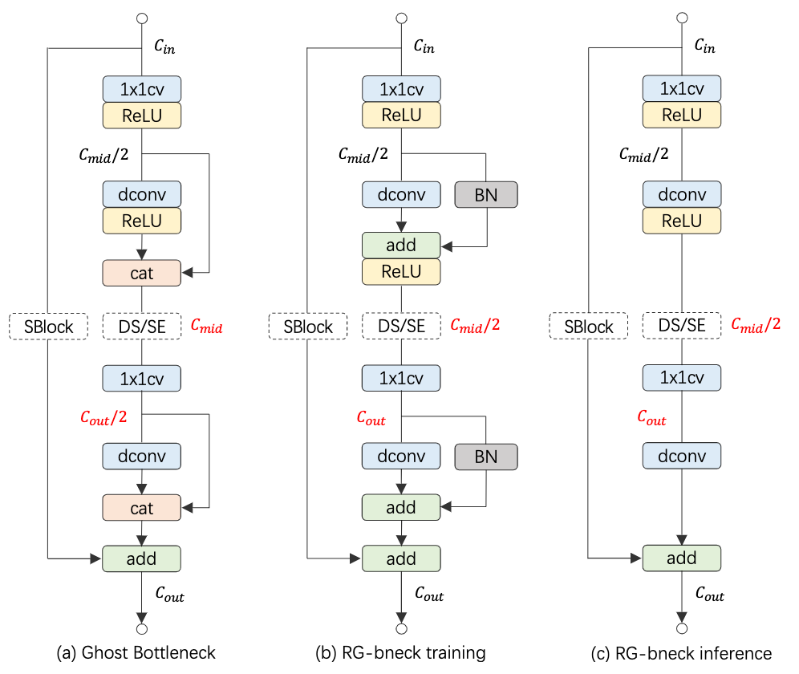
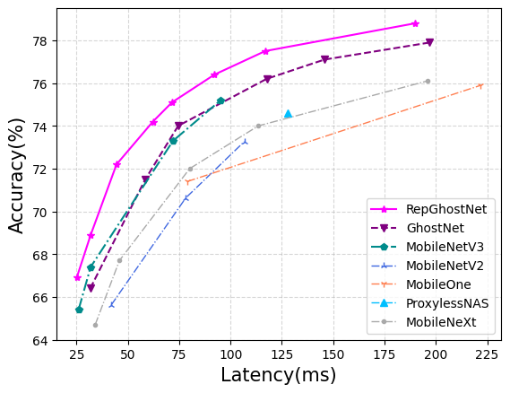

## RepGhost: A Hardware-Efficient Ghost Module via Re-parameterization

The official pytorch implementation of the paper **[RepGhost: A Hardware-Efficient Ghost Module via Re-parameterization](https://arxiv.org/abs/2211.06088)**

#### Chengpeng Chen\*, Zichao Guo\*, Haien Zeng, Pengfei Xiong, Jian Dong

>Feature reuse has been a key technique in light-weight convolutional neural networks (CNNs) design. Current methods usually utilize a concatenation operator to keep large channel numbers cheaply (thus large network capacity) by reusing feature maps from other layers. Although concatenation is parameters- and FLOPs-free, its computational cost on hardware devices is non-negligible. To address this, this paper provides a new perspective to realize feature reuse via structural re-parameterization technique. A novel hardware-efficient RepGhost module is proposed for implicit feature reuse via re-parameterization, instead of using concatenation operator. Based on the RepGhost module, we develop our efficient RepGhost bottleneck and RepGhostNet. Experiments on ImageNet and COCO benchmarks demonstrate that the proposed RepGhostNet is much more effective and efficient than GhostNet and MobileNetV3 on mobile devices. Specially, our RepGhostNet surpasses GhostNet 0.5x by 2.5% Top-1 accuracy on ImageNet dataset with less parameters and comparable latency on an ARM-based mobile phone.

<p align="center">

</p>

```python
python 3.9.12
pytorch 1.11.0
cuda 11.3
timm 0.6.7
```

```bash
git clone https://github.com/ChengpengChen/RepGhost
cd RepGhost
pip install -r requirements.txt
```

### Training
```bash
bash distributed_train.sh 8 --model repghost.repghostnet_0_5x -b 128 --lr 0.6 --sched cosine --epochs 300 --opt sgd -j 7 --warmup-epochs 5 --warmup-lr 1e-4 --weight-decay 1e-5 --drop 0.2 --amp --model-ema --model-ema-decay 0.9999 --remode pixel --reprob 0.2 --output work_dirs/train/  --data_dir {path_to_imagenet_dir}
```

### Validation
```bash
python3 -m torch.distributed.launch --nproc_per_node=8 --master_port=2340 validate.py -b 32 --model-ema --model {model} --resume {checkpoint_path} --data_dir {path_to_imagenet_dir}
```

### Convert a training-time RepGhost into a fast-inference one
To check the conversion example at ```convert.py```. You can also convert RepGhostNet model for fast inference via:

```python
model.convert_to_deploy()
```

### Results and Pre-trained Models

<p align="center">

</p>

| RepGhostNet | Params(M) | FLOPs(M) | Latency(ms) | Top-1 Acc.(%) | Top-5 Acc.(%) | checkpoints                                                                                          | logs                                                            |
|:------------|:----------|:---------|:------------|:--------------|:--------------|:-----------------------------------------------------------------------------------------------------|:----------------------------------------------------------------|
| 0.5x        | 2.3       | 43       | 25.1        | 66.9          | 86.9          | [googledrive](https://drive.google.com/file/d/16AGg-kSscFXDpXPZ3cJpYwqeZbUlUoyr/view?usp=share_link) | [log](./work_dirs/train/repghostnet_0_5x_43M_66.95/train.log)   |
| 0.58x       | 2.5       | 60       | 31.9        | 68.9          | 88.4          | [googledrive](https://drive.google.com/file/d/1L6ccPjfnCMt5YK-pNFDfqGYvJyTRyZPR/view?usp=share_link) | [log](./work_dirs/train/repghostnet_0_58x_60M_68.94/train.log)  |
| 0.8x        | 3.3       | 96       | 44.5        | 72.2          | 90.5          | [googledrive](https://drive.google.com/file/d/13gmUpwiJF_O05f3-3UeEyKD57veL5cG-/view?usp=share_link) | [log](./work_dirs/train/repghostnet_0_8x_96M_72.24/train.log)   |
| 1.0x        | 4.1       | 142      | 62.2        | 74.2          | 91.5          | [googledrive](https://drive.google.com/file/d/1gzfGln60urfY38elpPHVTyv9b94ukn5o/view?usp=share_link) | [log](./work_dirs/train/repghostnet_1_0x_142M_74.22/train.log)  |
| 1.11x       | 4.5       | 170      | 71.5        | 75.1          | 92.2          | [googledrive](https://drive.google.com/file/d/14Lk4pKWIUFk1Mb53ooy_GsZbhMmz3iVE/view?usp=share_link) | [log](./work_dirs/train/repghostnet_1_11x_170M_75.07/train.log) |
| 1.3x        | 5.5       | 231      | 92.9        | 76.4          | 92.9          | [googledrive](https://drive.google.com/file/d/1dNHpX2JyiuTcDmmyvr8gnAI9t8RM-Nui/view?usp=share_link) | [log](./work_dirs/train/repghostnet_1_3x_231M_76.37/train.log)  |
| 1.5x        | 6.6       | 301      | 116.9       | 77.5          | 93.5          | [googledrive](https://drive.google.com/file/d/1TWAY654Dz8zcwhDBDN6QDWhV7as30P8e/view?usp=share_link) | [log](./work_dirs/train/repghostnet_1_5x_301M_77.45/train.log)  |
| 2.0x        | 9.8       | 516      | 190.0       | 78.8          | 94.3          | [googledrive](https://drive.google.com/file/d/12k00eWCXhKxx_fq3ewDhCNX08ftJ-iyP/view?usp=share_link) | [log](./work_dirs/train/repghostnet_2_0x_516M_78.81/train.log)  |

#### Parameters and FLOPs
We calculate parameters and FLOPs using a modified [thop](https://github.com/Lyken17/pytorch-OpCounter) in ```tools.py```. It only counts infos of convolutional and full-connected layers, without BN. To use it in your code:

```python
from tools import cal_flops_params
flops, params = cal_flops_params(model, input_size=(1, 3, 224, 224))
```

#### Latency
We first export our pytorch model to a ONNX one, and then use [MNN](https://github.com/alibaba/MNN) to convert it to MNN format, at last evaluate its latency on an ARM-based mobile phone.


### Citations
If RepGhostNet helps your research or work, please consider citing:

```
@article{chen2022repghost,
  title={RepGhost: A Hardware-Efficient Ghost Module via Re-parameterization},
  author={Chen, Chengpeng, and Guo, Zichao, and Zeng, Haien, and Xiong, Pengfei and Dong, Jian},
  journal={arXiv preprint arXiv:2211.06088},
  year={2022}
}
```

### Contact

If you have any questions, please contact chencp@live.com.

---
